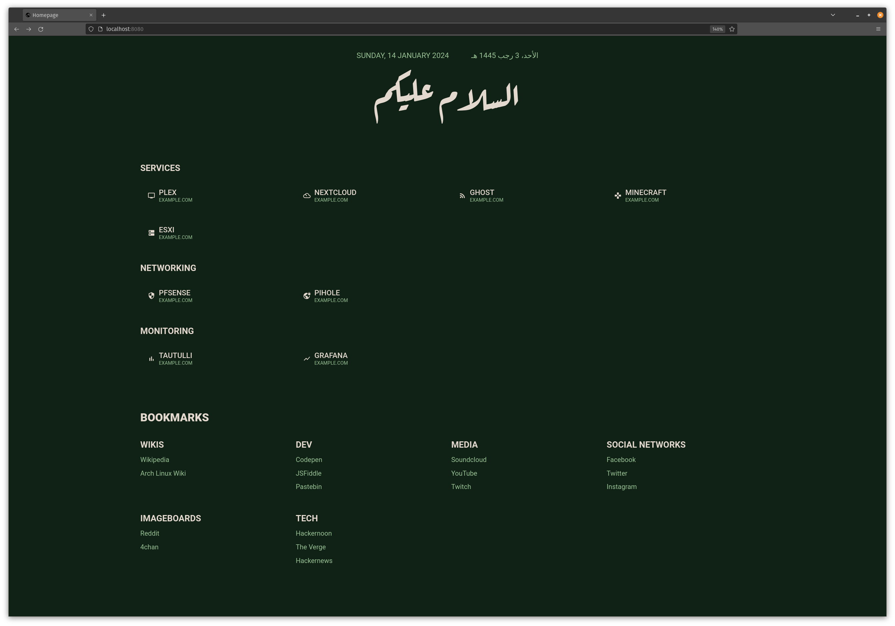

# Dashboard
A simple dashboard for use as a browser homepage or for a homeserver.

This dashboard is heavily inspired by [sui](https://github.com/jeroenpardon/sui), with the following changes:

- changed the docker compose file to use the simple [static-web-server](https://github.com/static-web-server/static-web-server/)
- removed gitpull functionality
- added support for hijri calendar
- removed the search functionality
- the displayed url under the applications doesn't have to match the actual ur anymore
- moved all `.json` files to [data](/data) directory
- the theme is now contained in the theme.json file
- added `favicon.ico`
- removed handlebars and used js to generate the html



### Deploy with Docker compose

#### Prerequisites:
 - Docker: [Linux](https://docs.docker.com/install/linux/docker-ce/debian/), [Mac](https://hub.docker.com/editions/community/docker-ce-desktop-mac), [Windows](https://hub.docker.com/editions/community/docker-ce-desktop-windows)
 - [Docker-compose](https://docs.docker.com/compose/install/)

#### Install:

 - `git clone` this repository
 - run `docker-compose up -d` in the root of the git repo you just cloned
 - The page should be available at  `http://localhost:8080`
 - to stop the container run `docker compose down -v`

*Note:* to access the dashboard through a different port, change the port value in the [`docker-compose.yaml`](./docker-compose.yaml) file

### Customization

#### Changing color themes
 - change the values in the [`theme.json`](./data/theme.json)

#### Apps and Services
Add your apps and services by editing apps.json:

```json5
{
  "apps": [
    {
      "name": "Plex",
      "displayURL": "example.com",
      "url": "https://example.com",
      "icon": "tv"
    },
    //...
  ],
  "categories": [
    {
      "name": "Networking",
      "items": [
        {
          "name": "pfSense",
          "displayURL": "example.com",
          "url": "https://example.com",
          "icon": "security"
        },
        //...
      ]
    },
    {
      "name": "Monitoring",
      "items": [
        {
          "name": "Tautulli",
          "displayURL": "example.com",
          "url": "https://example.com",
          "icon": "bar_chart"
        },
        //...
      ]
    }
  ]
}

```

*Note:* you can find the names  of icons to use at [Material Theme Icons](https://mui.com/material-ui/material-icons/)

#### Bookmarks
Add your bookmarks by editing bookmarks.json:

```json5
{
  "groups": [
    {
      "name": "Wikis",
      "items": [
        {
          "name": "Wikipedia",
          "url": "https://en.wikipedia.org/"
        },
        //...
      ]
    },
    {
      "name": "Dev",
      "items": [
        {
          "name": "Codepen",
          "url": "https://codepen.io/"
        },
        //...
      ]
    },
    {
      "name": "Media",
      "items": [
        {
          "name": "Soundcloud",
          "url": "https://soundcloud.com"
        },
        //...
      ]
    },
    {
      "name": "Social Networks",
      "items": [
        {
          "name": "Facebook",
          "url": "https://facebook.com"
        },
        //...
      ]
    },
    {
      "name": "Imageboards",
      "items": [
        {
          "name": "Reddit",
          "url": "https://reddit.com"
        },
        //...
      ]
    },
    {
      "name": "Tech",
      "items": [
        {
          "name": "Hackernoon",
          "url": "https://hackernoon.com"
        },
        //...
      ]
    }
  ]
}

```

#### Themes
Theme can be changed by modifying the [`theme.json`](./data/theme.json)

```json
{
  "accentColor": "#97C193",
  "backgroundColor": "#102116",
  "mainColor": "#E3D8CD"
}
```
